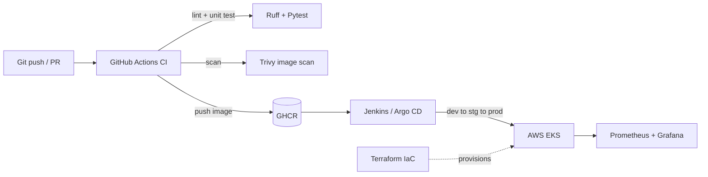

# Connected-Vehicle Telemetry Platform — End-to-End DevSecOps on AWS

A cloud-native platform that ingests simulated vehicle telemetry (speed, RPM, coolant
temperature, DTC/alert codes), evaluates safety alerts, and exposes metrics for
observability. The application is intentionally simple — **the showcase is the DevOps
platform around it**: CI/CD, containerization, Infrastructure as Code, GitOps, and
observability, built the way a real automotive/embedded engineering org would.

> Domain note: the telemetry + alerts model mirrors real Instrument Panel Cluster (IPC)
> alert-processing workflows, bridging automotive embedded delivery with cloud-native DevOps.

## Architecture



## Services

| Service | Description | Port |
|---------|-------------|------|
| `telemetry-ingest` | Accepts and stores vehicle telemetry readings, exposes latest reading + Prometheus metrics | 8000 |
| `alerts-processor` | Evaluates a telemetry reading against safety rules and returns alerts | 8001 |

## Roadmap (build in phases)

- [x] **Phase 1 — CI + Containers**: FastAPI services, multi-stage Docker, GitHub Actions CI, Trivy scan, push to GHCR
- [ ] **Phase 2 — Infrastructure as Code**: Terraform (VPC, EKS, ECR, IAM/IRSA, S3+DynamoDB remote state, workspaces per env)
- [ ] **Phase 3 — CD & GitOps**: Jenkins (Groovy declarative) + Argo CD, dev to staging to prod with approval gates, canary rollouts
- [ ] **Phase 4 — Observability & DevSecOps**: Prometheus/Grafana/Loki, Alertmanager, SBOM (syft), image signing (cosign), OPA/Gatekeeper, DORA metrics

## Quick start (local)

```bash
# Run both services + Prometheus locally
docker compose up --build

# telemetry-ingest -> http://localhost:8000/docs
# alerts-processor -> http://localhost:8001/docs
# prometheus       -> http://localhost:9090
```

Send a sample reading:

```bash
curl -X POST http://localhost:8000/telemetry \
  -H "Content-Type: application/json" \
  -d '{"vehicle_id":"VIN123","speed_kmph":135,"engine_rpm":6800,"coolant_temp_c":118,"dtc_codes":["P0128"]}'

curl -X POST http://localhost:8001/evaluate \
  -H "Content-Type: application/json" \
  -d '{"vehicle_id":"VIN123","speed_kmph":135,"engine_rpm":6800,"coolant_temp_c":118,"dtc_codes":["P0128"]}'
```

## Development

```bash
make install   # install dev dependencies for both services
make lint      # ruff
make test      # pytest
```

## Repository layout

```
connected-vehicle-platform/
├── services/
│   ├── telemetry-ingest/     # FastAPI ingest service
│   └── alerts-processor/     # FastAPI alert-rules service
├── monitoring/               # Prometheus config (Phase 1 local)
├── infra/terraform/          # Phase 2 (placeholder)
├── deploy/                   # Phase 3 k8s + Argo (placeholder)
├── .github/workflows/        # CI pipeline
└── docker-compose.yml
```
